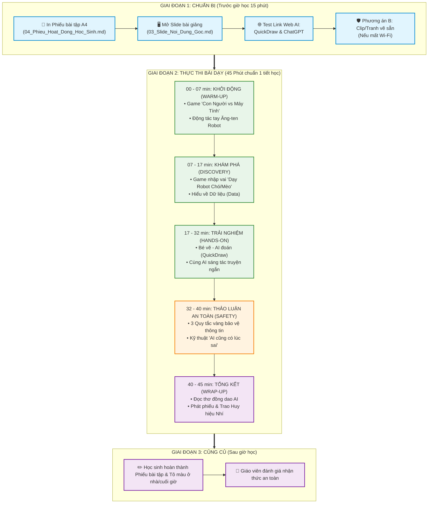

# 🗺️ SƠ ĐỒ CHIẾN LƯỢC & TIẾN TRÌNH GIẢNG DẠY (TEACHING FLOW & ROADMAP)
**Chủ đề**: Khám Phá Trí Tuệ Nhân Tạo (AI) Dành Cho Học Sinh Tiểu Học  
**Dành cho**: Giáo viên đứng lớp | **Thời lượng chuẩn**: 45 phút (1 Tiết học)

---

## 📊 1. SƠ ĐỒ TIẾN TRÌNH TỔNG QUAN (OVERALL MERMAID FLOW - 45 PHÚT)



---

## ⏱️ 2. BẢNG TIẾN TRÌNH CHI TIẾT THEO PHÚT (TIMELINE ROADMAP - 45 PHÚT)

```
┌──────────┬─────────────────────────────┬─────────────────────────────────┬──────────────────────────────┐
│  Thời gian│ Tên hoạt động               │ Hành động của Giáo viên         │ Hành động của Học sinh       │
├──────────┼─────────────────────────────┼─────────────────────────────────┼──────────────────────────────┤
│ 00 - 04' │ 🚀 Đón lớp & Khởi động     │ Nêu luật chơi "Con Người vs AI" │ Hô to đáp án & tương tác     │
│ 04 - 07' │ 💃 Động tác Ăng-ten Robot   │ Hướng dẫn động tác tay phản xạ  │ Đứng lên làm theo nhịp điệu  │
│ 07 - 13' │ 🐾 Game "Dạy Robot"        │ Đóng vai Người dạy Data Trainer │ 1 bạn nhập vai Robot AI      │
│ 13 - 17' │ 🧠 Giải thích Dữ liệu (Data)│ Dùng sơ đồ "Thức ăn của AI"     │ Quan sát & trả lời câu hỏi   │
│ 17 - 25' │ 🎨 Bé vẽ - AI đoán          │ Mở QuickDraw trên máy chiếu     │ 2 em lên bảng vẽ trực tiếp   │
│ 25 - 32' │ 📖 Sáng tác truyện với AI   │ Gõ câu chuyện từ ý tưởng lớp    │ Đóng góp nhân vật kỳ diệu    │
│ 32 - 37' │ 🛡️ 3 Quy tắc vàng an toàn   │ Đưa tình huống thực tế          │ Thảo luận & phản biện        │
│ 37 - 40' │ ❌ Kỹ thuật AI đoán sai     │ Cố tình cho AI trả lời sai      │ Cười & phát hiện lỗi của AI  │
│ 40 - 43' │ 📜 Đọc thơ đồng dao AI      │ Bắt nhịp bài thơ 4 câu          │ Đọc đồng thanh cả lớp        │
│ 43 - 45' │ 🏅 Trao huy hiệu & Dặn dò   │ Trao huy hiệu giấy & phát phiếu │ Nhận quà & làm phiếu về nhà  │
└──────────┴─────────────────────────────┴─────────────────────────────────┴──────────────────────────────┘
```

---

## 📋 3. CHECKLIST KIỂM TRA TRƯỚC VÀ SAU TIẾT HỌC

### 🔴 CHECKLIST TRƯỚC GIỜ HỌC (Trước 15 phút):
- [ ] Đã in đủ **Phiếu hoạt động** cho 100% học sinh trong lớp.
- [ ] Đã test đường truyền mạng Wi-Fi và mở sẵn tab web: `quickdraw.withgoogle.com` và `chatgpt.com`.
- [ ] Đã chiếu thử **Slide 1** lên màn hình máy chiếu xem hình ảnh và chữ có rõ nét không.
- [ ] Chuẩn bị sẵn 1 bộ tranh in giấy (Chó, Mèo, Quả táo) làm phương án dự phòng khi mất kết nối mạng.

### 🟢 CHECKLIST TRONG GIỜ HỌC:
- [ ] Học sinh hào hứng tham gia trò chơi khởi động.
- [ ] 100% học sinh nắm được từ khóa: **Dữ liệu (Data)** và **3 Quy tắc an toàn**.
- [ ] Kiểm soát thời gian chuẩn xác theo từng mốc (7' - 10' - 15' - 8' - 5').

### 🟡 CHECKLIST SAU GIỜ HỌC:
- [ ] Thu phiếu bài tập hoặc dặn các em hoàn thành ở nhà.
- [ ] Nhận xét tiết học và khen thưởng cả lớp.

---

## 🛡️ 4. KỊCH BẢN XỬ LÝ SỰ CỐ TRÊN BỤC GIẢNG (RISK MANAGEMENT)

| Sự cố phát sinh | Nguyên nhân | Kịch bản xử lý của Giáo viên |
| :--- | :--- | :--- |
| **Mất Wi-Fi / Mạng quá chậm** | Nghẽn mạng trường học | Chuyển ngay sang **Phương án B**: Giơ bức ảnh vẽ sẵn ra và đóng vai "Giáo viên là cỗ máy AI", đố học sinh đoán. |
| **AI trả lời ra từ ngữ khó hiểu** | ChatGPT dùng từ người lớn | Giáo viên đọc lướt nhanh và **dịch lại theo ngôn ngữ tiểu học** cho cả lớp nghe. |
| **Học sinh ồn ào khi chơi game** | Các em quá hào hứng | Hô khẩu lệnh phản xạ: *Giáo viên hô "Robot đâu?" ➡️ Học sinh khoanh tay hô "Robot đây!"* để ổn định trật tự. |
