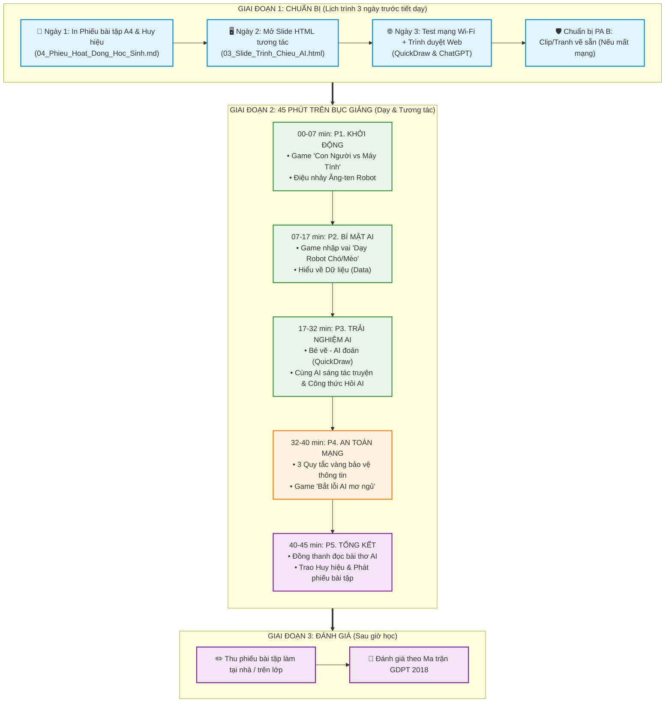

# 🗺️ SƠ ĐỒ CHIẾN LƯỢC, MENU TIẾN TRÌNH & LỊCH TRÌNH CHUẨN (MASTER PLAN)
**Chủ đề**: Khám Phá Trí Tuệ Nhân Tạo (AI) Dành Cho Học Sinh Tiểu Học  
**Dành cho**: Giáo viên đứng lớp | **Thời lượng chuẩn**: 45 phút (1 Tiết học)

---

## 🗂️ 1. MENU ĐIỀU HƯỚNG TIẾN TRÌNH BÀI DẠY (VISUAL FLOW MENU)

Giáo viên có thể nhìn vào Menu này để nắm bắt ngay cấu trúc và bấm chuyển nhanh giữa các phần:

```
+-----------------------------------------------------------------------------------+
|                        📌 MENU TIẾN TRÌNH BÀI DẠY 45 PHÚT                         |
+-----------------------------------------------------------------------------------+
|  [PHẦN 1] 🚀 KHỞI ĐỘNG & GAME "CON NGƯỜI VS AI"           ⏱️ 00' - 07' (7 phút) |
|   ├── Game đố vui 4 câu: Máy tính tính nhanh - Con người yêu thương               |
|   └── Điệu nhảy Ăng-ten Robot & Trái tim (Vận động tại chỗ)                      |
+-----------------------------------------------------------------------------------+
|  [PHẦN 2] 🧠 BÍ MẬT AI & "CƠM SỮA CỦA AI LA GÌ?"          ⏱️ 07' - 17' (10 phút)|
|   ├── Game nhập vai: "Dạy Baby Robot học nhận biết Chó / Mèo"                    |
|   └── Khái niệm ẩn dụ: Dữ liệu (Data) là "Thức ăn bổ dưỡng của AI"                |
+-----------------------------------------------------------------------------------+
|  [PHẦN 3] 🎮 TRẢI NGHIỆM AI & CÔNG THỨC ĐẶT CÂU HỎI       ⏱️ 17' - 32' (15 phút)|
|   ├── Game 1: Bé vẽ AI đoán (Google QuickDraw)                                    |
|   ├── Game 2: Cùng AI sáng tác truyện cổ tích (ChatGPT)                           |
|   └── Bật mí Công thức 3 bước: "Đặt câu hỏi thông minh cho AI"                   |
+-----------------------------------------------------------------------------------+
|  [PHẦN 4] 🛡️ THẢO LUẬN AN TOÀN & BẮT LỖI AI              ⏱️ 32' - 40' (8 phút) |
|   ├── 3 Quy tắc vàng an toàn kỹ thuật số (Đèn Đỏ - Đèn Vàng - Đèn Xanh)            |
|   └── Game 3: Thám tử bắt lỗi "AI mơ ngủ / đoán sai"                             |
+-----------------------------------------------------------------------------------+
|  [PHẦN 5] 🏆 TỔNG KẾT, ĐỒNG DAO & TRAO HUY HIỆU           ⏱️ 40' - 45' (5 phút) |
|   ├── Đọc đồng thanh bài thơ Đồng Dao AI 4 câu                                   |
|   └── Trao Huy hiệu "Nhà Khai Phá AI Nhí" & Phát phiếu bài tập tô màu             |
+-----------------------------------------------------------------------------------+
```

---

## 📊 2. SƠ ĐỒ CHIẾN LƯỢC MERMAID TỔNG QUAN



---

## 📅 3. LỊCH TRÌNH CHUẨN BỊ 3 NGÀY TRƯỚC GIỜ G (PRE-LESSON ACTION PLAN)

```
┌─────────────┬─────────────────────────────────────┬────────────────────────────────────────────────────────┐
│ Thời gian   │ Công việc chính của Giáo viên       │ Tệp tài liệu sử dụng                                   │
├─────────────┼─────────────────────────────────────┼────────────────────────────────────────────────────────┤
│ **Ngày N-2**│ In ấn Phiếu bài tập & Huy hiệu nhí │ In tệp 04_Phieu_Hoat_Dong_Hoc_Sinh.md & Phụ lục 2 giáo án │
│ **Ngày N-1**│ Chuẩn bị Slide & Test thiết bị     │ Mở 03_Slide_Trinh_Chieu_AI.html, thử giọng nói AI & loa │
│ **Ngày N**  │ 15 phút trước giờ G tại lớp         │ Kiểm tra máy chiếu, mở sẵn tab QuickDraw & ChatGPT     │
└─────────────┴─────────────────────────────────────┴────────────────────────────────────────────────────────┘
```

---

## ⏱️ 4. TIẾN TRÌNH CHI TIẾT 45 PHÚT TRÊN LỚP

```
┌──────────┬─────────────────────────────┬─────────────────────────────────┬──────────────────────────────┐
│  Thời gian│ Tên hoạt động               │ Hành động của Giáo viên         │ Hành động của Học sinh       │
├──────────┼─────────────────────────────┼─────────────────────────────────┼──────────────────────────────┤
│ 00 - 04' │ 🚀 Đón lớp & Khởi động     │ Mở Slide 1, nêu luật chơi AI    │ Hô to đáp án & tương tác     │
│ 04 - 07' │ 💃 Động tác Ăng-ten Robot   │ Hướng dẫn động tác tay phản xạ  │ Đứng lên làm theo nhịp điệu  │
│ 07 - 13' │ 🐾 Game "Dạy Robot"        │ Đóng vai Người dạy Data Trainer │ 1 bạn nhập vai Robot AI      │
│ 13 - 17' │ 🧠 Giải thích Dữ liệu (Data)│ Dùng sơ đồ "Thức ăn của AI"     │ Quan sát & hô "DỮ LIỆU"      │
│ 17 - 24' │ 🎨 Bé vẽ - AI đoán          │ Mở QuickDraw trên máy chiếu     │ 2 em lên bảng vẽ trực tiếp   │
│ 24 - 29' │ 📖 Sáng tác truyện với AI   │ Gõ câu chuyện từ ý tưởng lớp    │ Đóng góp nhân vật kỳ diệu    │
│ 29 - 32' │ 💡 Công thức 3 bước hỏi AI │ Dạy trẻ cách đặt câu hỏi đúng   │ Nhắc lại 3 bước hỏi AI       │
│ 32 - 37' │ 🛡️ 3 Quy tắc vàng an toàn   │ Đưa tình huống thực tế          │ Thảo luận & phản biện        │
│ 37 - 40' │ ❌ Kỹ thuật AI đoán sai     │ Chơi Game 3 bắt lỗi AI          │ Cười & phát hiện lỗi của AI  │
│ 40 - 43' │ 📜 Đọc thơ đồng dao AI      │ Bắt nhịp bài thơ 4 câu          │ Đọc đồng thanh cả lớp        │
│ 43 - 45' │ 🏅 Trao huy hiệu & Dặn dò   │ Trao huy hiệu giấy & phát phiếu │ Nhận quà & làm phiếu về nhà  │
└──────────┴─────────────────────────────┴─────────────────────────────────┴──────────────────────────────┘
```

---

## 🛡️ 5. KỊCH BẢN XỬ LÝ SỰ CỐ TRÊN BỤC GIẢNG (RISK MANAGEMENT)

| Sự cố phát sinh | Nguyên nhân | Kịch bản xử lý của Giáo viên |
| :--- | :--- | :--- |
| **Mất Wi-Fi / Mạng quá chậm** | Nghẽn mạng trường học | Chuyển ngay sang **Phương án B**: Giơ bức ảnh vẽ sẵn ra và đóng vai "Giáo viên là cỗ máy AI", đố học sinh đoán. |
| **AI trả lời ra từ ngữ khó hiểu** | ChatGPT dùng từ người lớn | Giáo viên đọc lướt nhanh và **dịch lại theo ngôn ngữ tiểu học** cho cả lớp nghe. |
| **Học sinh ồn ào khi chơi game** | Các em quá hào hứng | Hô khẩu lệnh phản xạ: *Giáo viên hô "Robot đâu?" ➡️ Học sinh khoanh tay hô "Robot đây!"* để ổn định trật tự. |
