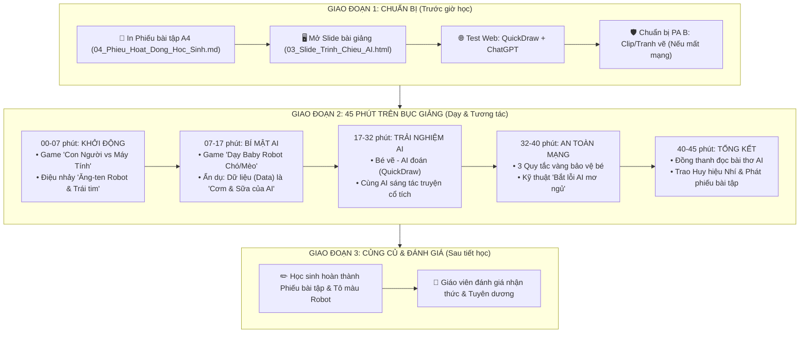

# GIÁO ÁN ĐỔI MỚI: KHÁM PHÁ TRÍ TUỆ NHÂN TẠO (AI)
**Thời lượng**: 45 phút (1 Tiết học chuẩn) | **Đối tượng**: Học sinh Tiểu học (Lớp 1 - Lớp 5)  
**Tác giả**: Giáo viên Tiểu học Giỏi Cấp Quốc Gia | **Tiêu chuẩn**: Chuẩn Chương trình GDPT 2018

---

## 🗺️ SƠ ĐỒ CHIẾN LƯỢC TIẾN TRÌNH BÀI GIẢNG (TEACHING FLOW - 45 PHÚT)



---

## I. MỤC TIÊU BÀI HỌC (CHỦN NĂNG LỰC & PHẨM CHẤT GDPT 2018)

### 1. Kiến thức
- Học sinh giải thích được khái niệm AI bằng câu nói đơn giản: *"AI giống như một bạn Robot được con người dạy để biết suy nghĩ và giúp đỡ chúng ta!"*.
- Phân biệt rõ ràng: **Con người có Trái tim & Tình yêu thương**, còn **AI có Bộ nhớ khổng lồ & Tốc độ tính toán siêu nhanh**.
- Hiểu nguyên lý cơ bản: **AI thông minh nhờ ăn "Dữ liệu (Data)"** (Hình ảnh, Âm thanh, Chữ viết) mỗi ngày.

### 2. Kỹ năng & Năng lực đặc thù
- **Năng lực Tin học (NLA)**: Trải nghiệm công cụ AI nhận diện hình vẽ và tương tác câu lệnh tạo truyện đơn giản.
- **Năng lực Giao tiếp & Hợp tác (NLb)**: Đóng vai người dạy Robot và thảo luận nhóm trong các game đố vui.

### 3. Phẩm chất & An toàn kỹ thuật số
- Nhớ như in **3 Quy tắc vàng**: *Không cho AI biết bí mật cá nhân*, *Không tin AI 100% vì AI có lúc mơ ngủ*, và *Bộ não của bé mới là số 1!*

---

## II. CHUẨN BỊ BÀI GIẢNG

### 1. Dành cho Giáo viên:
- Máy tính kết nối máy chiếu / Màn hình TV.
- Slide bài giảng HTML tương tác (Mở file `03_Slide_Trinh_Chieu_AI.html`).
- Bộ thẻ tranh minh họa (Hình con người, robot, chó/mèo).
- Mở sẵn trình duyệt web:
  - [Google Quick, Draw!](https://quickdraw.withgoogle.com/)
  - [ChatGPT / Copilot](https://chatgpt.com/)

### 2. Dành cho Học sinh:
- Phiếu bài tập tô màu (In từ file `04_Phieu_Hoat_Dong_Hoc_Sinh.md`).
- Hộp màu vẽ, bút chì.

---

## III. TIẾN TRÌNH DẠY HỌC CHI TIẾT (45 PHÚT)

---

### PHẦN 1: KHỞI ĐỘNG & GAME "CON NGƯỜI VS MÁY TÍNH" (7 PHÚT)

#### 🎯 Mục tiêu: 
Thu hút 100% sự chú ý, tạo tiếng cười rộn ràng và giúp các em thấy được sự đặc biệt của Trái tim con người.

#### 🎙️ Lời thoại & Hoạt động của Giáo viên:
- **Giáo viên**: *"Chào các nhà khai phá nhí! Hôm nay thầy/cô mang đến lớp mình một người bạn siêu đặc biệt. Người bạn này không ăn cơm, không uống sữa, nhưng lại có một bộ脑 làm bằng vi mạch kim loại! Trước khi gặp người bạn ấy, chúng ta hãy cùng chơi Game trên Slide tương tác: **AI GIỎI HƠN? CON NGƯỜI VS MÁY TÍNH!**"*

#### ❓ 4 Câu hỏi đố vui bùng nổ:
1. **Câu 1**: *Thực hiện 10.000 phép tính nhân chia trong 1 giây?* ➡️ **Máy tính AI** 💻
2. **Câu 2**: *Thấy bạn thân bị ngã đau liền chạy lại ôm bạn và an ủi?* ➡️ **Con người** ❤️
3. **Câu 3**: *Nhớ nội dung của 1 triệu cuốn sách trong thư viện?* ➡️ **Máy tính AI** 📚
4. **Câu 4**: *Vẽ một bức tranh thật đẹp từ tình yêu dành cho bố mẹ?* ➡️ **Con người** 🎨

#### 💃 Động tác tay Ăng-ten Robot (1 phút):
- **Giáo viên hô**: *"AI Máy tính đâu?"* ➡️ **Học sinh xòe 2 tay lên đầu làm ăng-ten hô**: *"Tít tít tính nhanh!"*
- **Giáo viên hô**: *"Con người đâu?"* ➡️ **Học sinh ôm 2 tay lên ngực trái hô**: *"Yêu thương sáng tạo!"*

---

### PHẦN 2: BÍ MẬT ĐẰNG SAU AI - "CƠM & SỮA CỦA AI LÀ GÌ?" (10 PHÚT)

#### 🎯 Mục tiêu:
Giải thích khái niệm **Dữ liệu (Data)** bằng hình ảnh ẩn dụ *"Thức ăn của Robot"*.

#### 🐾 Trò chơi nhập vai "Dạy Baby Robot":
- Giáo viên mời 1 bạn học sinh lên bảng đeo bờm ăng-ten đóng vai **Baby Robot AI**.
- Giáo viên giơ 5 bức ảnh Con Chó và 5 bức ảnh Con Mèo cho Baby Robot xem:
  - *"Đây là Con Chó: tai dài, mũi to, kêu gâu gâu!"*
  - *"Đây là Con Mèo: tai nhọn, có ria, kêu meow meow!"*
- Giáo viên giơ bức ảnh thứ 11 và hỏi: *"Baby Robot ơi, đây là con gì?"* ➡️ Robot trả lời: *"Con Chó!"* ➡️ **Cả lớp vỗ tay.**

#### 🧠 Rút ra bài học siêu dễ hiểu:
- **Giáo viên**: *"Học sinh ăn Cơm & Uống Sữa 🥛 để cao lớn. Còn AI 'ăn Dữ liệu (Data)' để trở nên thông minh!"*
- **Khẩu lệnh phản xạ**: Giáo viên hô *"Thức ăn của AI là gì?"* ➡️ Cả lớp hô to *"DỮ LIỆU!"*.

---

### PHẦN 3: TRẢI NGHIỆM THỰC TẾ - "BÉ VẼ AI ĐOÁN & SÁNG TÁC TRUYỆN" (15 PHÚT)

#### 🖥️ Hoạt động 1: Game "Bé Vẽ - AI Đoán" (8 phút)
- Mở `quickdraw.withgoogle.com`. Mời 2 học sinh lên bảng vẽ hình đơn giản trong 20 giây để AI phát thanh đoán tên.

#### 🎨 Hoạt động 2: "Cùng AI Sáng Tác Truyện Cổ Tích" (7 phút)
- Mở ChatGPT. Học sinh đưa ý tưởng nhân vật (*Thỏ biết bay, Nấm biết hát*). AI viết câu chuyện 4 câu.
- **Giáo viên nhấn mạnh**: *"AI viết rất nhanh, nhưng ý tưởng chú thỏ biết bay là của các con! Bộ脑 con người luôn là số 1!"*

---

### PHẦN 4: THẢO LUẬN AN TOÀN - 3 QUY TẮC VÀNG BẢO VỆ BÉ (8 PHÚT)

#### 🛡️ 3 QUY TẮC VÀNG BẢO VỆ BÉ KHI CHƠI VỚI AI:
1. 🛑 **KHÔNG CHIA SẺ BÍ MẬT CÁ NHÂN**: Không cho AI biết họ tên đầy đủ, địa chỉ nhà, số điện thoại bố mẹ hay mật khẩu.
2. ⚠️ **AI CÓ LÚC MƠ NGỦ - KHÔNG TIN 100%**: AI đôi khi bị đoán mò hoặc trả lời sai. Luôn kiểm tra lại với thầy cô, bố mẹ!
3. 🟢 **TỰ NGHĨ TRƯỚC - AI CHỈ LÀ TRỢ LÝ**: Não bé mới là "siêu máy tính" tuyệt vời nhất!

#### ❌ Mẹo vui "Bắt lỗi AI mơ ngủ" (1 phút):
- Mở Game 3 trên Slide HTML, cho học sinh phát hiện câu sai của AI ➡️ Reo hò khen thưởng.

---

### PHẦN 5: TỔNG KẾT & CẤP HUY HIỆU (5 PHÚT)

#### 📜 Bài thơ Đồng Dao AI (Đọc đồng thanh 1 phút):
> *"AI giỏi tính, nhớ siêu nhiều,*  
> *Nhưng không có trái tim yêu con người.*  
> *Bé ngoan làm chủ nụ cười,*  
> *Học chăm, suy nghĩ, điểm 10 tương lai!"*

#### 🏅 Trao Huy Hiệu & Phát Phiếu Hoạt Động (4 phút):
- Phát phiếu [04_Phieu_Hoat_Dong_Hoc_Sinh.md](file:///d:/DuAnAIHieuChoHocSinh/04_Phieu_Hoat_Dong_Hoc_Sinh.md).
- Trao danh hiệu giấy: **"NHÀ KHÁI PHÁ AI NHÍ THÔNG THÁI"**.

---

## 📌 PHỤ LỤC 1: ĐÁP ÁN MẪU & BẢNG ĐÁNH GIÁ HỌC SINH (GDPT 2018)

### 📝 1. Đáp án phiếu bài tập (04_Phieu_Hoat_Dong_Hoc_Sinh.md):
- **Bài tập 1**: 1-D (AI), 2-A (Con người), 3-D (AI), 4-A (Con người).
- **Bài tập 3 (Đúng/Sai)**: 1-S, 2-Đ, 3-Đ, 4-S, 5-Đ.

### 📊 2. Bảng ma trận đánh giá mức độ đạt được của học sinh:
| Tiêu chí đánh giá | Mức Tốt (T) | Mức Hoàn thành (HT) | Mức Cần cố gắng (CG) |
| :--- | :--- | :--- | :--- |
| **Nhận thức về AI** | Nêu đúng AI là gì, phân biệt được thế mạnh của Con người vs AI | Nêu được AI là máy tính thông minh | Chưa phân biệt được máy tính thường và AI |
| **Hiểu về Dữ liệu** | Nêu được ví dụ AI học từ ảnh/chữ | Nêu được từ khóa "Dữ liệu" | Chưa hiểu cách AI học |
| **Ý thức an toàn** | Nhớ 3 Quy tắc vàng và tự giác bảo vệ bí mật cá nhân | Nhớ 2/3 Quy tắc an toàn | Còn chia sẻ thông tin cá nhân |

---

## 📌 PHỤ LỤC 2: MẪU HUY HIỆU GIẤY IN SẴN KHỔ A4 (PRINTABLE BADGES)

Giáo viên có thể in trang này ra khổ giấy A4 bìa cứng, cắt theo hình tròn và dán băng dính 2 mặt để gắn lên ngực áo học sinh ở cuối tiết học:

```
+------------------------------------+  +------------------------------------+
|  🏅 NHÀ KHÁI PHÁ AI NHÍ THÔNG THÁI  |  |  🏅 NHÀ KHÁI PHÁ AI NHÍ THÔNG THÁI  |
|               🤖 🌟                |  |               🤖 🌟                |
|      "Bộ não bé là số 1!"          |  |      "Bộ brain bé là số 1!"        |
|  Em: ............................  |  |  Em: ............................  |
+------------------------------------+  +------------------------------------+
```
