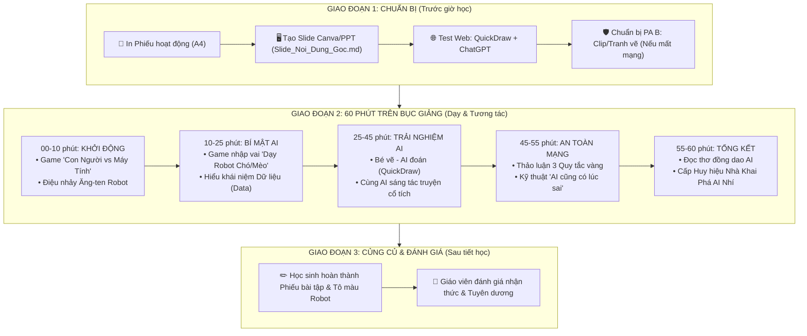

# GIÁO ÁN CHI TIẾT: KHÁM PHÁ TRÍ TUỆ NHÂN TẠO (AI)
**Thời lượng**: 60 phút | **Đối tượng**: Học sinh Tiểu học (Lớp 1 - Lớp 5)  
**Tác giả**: Giáo viên Tiểu học | **Mục tiêu**: Giúp học sinh hiểu AI là gì, AI hoạt động ra sao và cách sử dụng AI an toàn.

---

## 🗺️ SƠ ĐỒ CHIẾN LƯỢC TIẾN TRÌNH BÀI GIẢNG (TEACHING FLOW)



---

## I. MỤC TIÊU BÀI HỌC

### 1. Kiến thức
- Học sinh giải thích được khái niệm **AI (Trí tuệ Nhân tạo)** bằng ngôn ngữ đơn giản: *"AI là những phần mềm/máy tính được con người dạy để biết suy nghĩ và học hỏi, giúp đỡ con người làm việc"*.
- Biết cách phân biệt **Trí tuệ Con người** (cảm xúc, tình yêu thương, sự sáng tạo chân thật) và **Trí tuệ Nhân tạo** (tính toán nhanh, ghi nhớ siêu nhiều, xử lý dữ liệu lớn).
- Hiểu được nguyên lý AI học tập: **AI học từ Dữ liệu (Data)** (hình ảnh, âm thanh, chữ viết) giống như học sinh học từ sách vở và quan sát thế giới xung quanh.

### 2. Kỹ năng
- Biết trải nghiệm và tương tác đơn giản với công cụ AI (ví dụ: vẽ hình cho AI đoán, thử nghiệm nhận diện).
- Biết cách đặt câu hỏi đơn giản hoặc yêu cầu cơ bản cho AI trợ lý.

### 3. Phẩm chất & Đạo đức (An toàn kỹ thuật số)
- Nhận thức được 3 Quy tắc an toàn: **Không chia sẻ thông tin cá nhân**, **Không tin AI 100% (AI có thể đoán sai)**, và **Coi AI là người trợ lý chứ không làm hộ bài tập hoàn toàn**.

---

## II. CHUẨN BỊ BÀI GIẢNG

### 1. Dành cho Giáo viên:
- Máy tính có kết nối Internet, máy chiếu (Projector) hoặc màn hình TV lớp học.
- Slide bài giảng (Dựa trên file `03_Slide_Noi_Dung_Goc.md`).
- Các bộ thẻ bài minh họa (Thẻ tranh con người, thẻ tranh máy tính, thẻ tranh chó/mèo).
- Đường link sẵn các trang web trải nghiệm AI miễn phí:
  - [Google Quick, Draw!](https://quickdraw.withgoogle.com/) (AI đoán hình vẽ)
  - [AutoDraw](https://www.autodraw.com/) (AI biến nét vẽ nguệch ngoạc thành hình đẹp)
  - [Teachable Machine](https://teachablemachine.withgoogle.com/) (Dạy AI qua Webcam - nếu có chuẩn bị trước)

### 2. Dành cho Học sinh:
- Phiếu hoạt động học sinh (In từ file `Phieu_Hoat_Dong_Hoc_Sinh.md`).
- Bút màu, bút chì.

---

## III. TIẾN TRÌNH DẠY HỌC CHI TIẾT (60 PHÚT)

---

### PHẦN 1: KHỞI ĐỘNG & GAME "CON NGƯỜI VS MÁY TÍNH" (10 PHÚT)

#### 🎯 Mục tiêu: 
Tạo không khí vui vẻ, thu hút sự chú ý và giúp học sinh so sánh khả năng của con người với máy tính thông thường.

#### 🎙️ Lời thoại & Hoạt động của Giáo viên:
- **Giáo viên (nhiệt huyết)**: *"Chào các con! Hôm nay cô/thầy có mang đến lớp một người bạn rất đặc biệt. Nhưng trước khi giới thiệu người bạn này, chúng ta hãy cùng chơi một trò chơi có tên: **Ai Giỏi Hơn? Con Người hay Máy Tính!**"*
- **Giáo viên nêu luật chơi**: Cô sẽ đưa ra các nhiệm vụ, các con hãy giơ tay chọn xem **Con người** làm tốt hơn hay **Máy tính** làm tốt hơn nhé!

#### ❓ Các câu hỏi đố vui:
1. **Câu 1**: *Tính 9.876 x 5.432 trong 1 giây?* 
   - ➡️ **Đáp án**: Máy tính thắng! 💻 (Máy tính tính siêu nhanh).
2. **Câu 2**: *Cảm thấy buồn khi bạn thân bị ốm và ôm bạn một cái?*
   - ➡️ **Đáp án**: Con người thắng! ❤️ (Máy tính không có trái tim và cảm xúc).
3. **Câu 3**: *Nhớ tên của 1 triệu cuốn sách trong thư viện cùng lúc?*
   - ➡️ **Đáp án**: Máy tính thắng! 📚 (Bộ nhớ máy tính siêu khổng lồ).
4. **Câu 4**: *Tự nghĩ ra một câu chuyện cổ tích kỳ diệu xuất phát từ tình thương mẹ?*
   - ➡️ **Đáp án**: Con người thắng! 🌟 (Sự sáng tạo và tình yêu thương của con người là duy nhất).

#### 💡 Dẫn dắt vào bài:
- **Giáo viên**: *"Các con thấy đấy, máy tính thông thường rất giỏi tính toán và ghi nhớ. Nhưng nếu máy tính không chỉ biết tính số, mà còn biết **VẼ TRANH, LẮNG NGHE, NÓI CHUYỆN, và DẠY HỌC** như con người thì sao nhỉ? Người ta gọi bộ não thông minh đó của máy tính là **AI - Trí tuệ Nhân tạo!**"*

---

### PHẦN 2: BÍ MẬT ĐẰNG SAU AI - AI HỌC NHƯ THẾ NÀO? (15 PHÚT)

#### 🎯 Mục tiêu:
Giải thích khái niệm **Dữ liệu (Data)** và cách AI học hỏi bằng ví dụ trực quan dễ hiểu.

#### 🎙️ Lời thoại & Hoạt động của Giáo viên:

- **Giáo viên**: *"Các con có tò mò làm sao một cỗ máy làm bằng kim loại và vi mạch lại có thể thông minh như vậy không? Hãy cùng chơi tiếp trò chơi thứ hai: **Dạy Robot Nhận Biết Con Chó và Con Mèo!**"*

#### 🐾 Trò chơi nhập vai "Dạy Robot":
- Giáo viên chọn 1 học sinh lên đóng vai **Robot AI mới sinh** (chưa biết gì).
- Giáo viên đóng vai **Người dạy (Data Trainer)**.
- Giáo viên giơ lên 5 bức ảnh Con Chó (tai dài, mũi to, kêu gâu gâu) và nói với Robot: *"Đây là Con Chó"*.
- Giáo viên giơ tiếp 5 bức ảnh Con Mèo (tai nhọn, ria dài, kêu meow meow) và nói: *"Đây là Con Mèo"*.
- Sau đó, giáo viên giơ bức ảnh thứ 11 (một con chó hoạt hình hoặc một giống chó mới) và hỏi Robot AI: *"Đây là con gì?"*
- Học sinh đóng vai Robot trả lời: *"Con Chó!"*.
- Cả lớp vỗ tay khen ngợi.

#### 🧠 Rút ra bài học cốt lõi:
- **Giáo viên**: *"Các con thấy không? Robot AI không hề sinh ra đã biết con chó hay con mèo. AI thông minh vì nó được xem **RẤT NHIỀU HÌNH ẢNH**. Hàng triệu hình ảnh đó được gọi là **DỮ LIỆU (DATA)**. Dữ liệu chính là **thức ăn bổ dưỡng** giúp bộ não AI ngày càng thông minh hơn!"*

```
[Sách vở, quan sát] ➡️ Học sinh học tập ➡️ Bé thông minh hơn
[Dữ liệu: Tranh, Chữ, Âm thanh] ➡️ AI học tập ➡️ AI thông minh hơn
```

---

### PHẦN 3: TRẢI NGHIỆM THỰC TẾ & TƯƠNG TÁC VỚI AI (20 PHÚT)

#### 🎯 Mục tiêu:
Cho học sinh trực tiếp quan sát và trải nghiệm sức mạnh của AI thông qua công cụ nhận diện trực quan.

#### 🖥️ Hoạt động 1: Trò chơi "Bé vẽ - AI đoán" (10 phút)
- **Công cụ**: Sử dụng trang web [Google Quick, Draw!](https://quickdraw.withgoogle.com/) hiển thị lên máy chiếu.
- **Cách thực hiện**:
  1. Giáo viên mời 2 - 3 học sinh lên bảng, dùng chuột hoặc bảng tương tác vẽ một vật thể đơn giản (Ví dụ: cái cây, ngôi nhà, con cá, quả táo) trong vòng 20 giây.
  2. Cả lớp quan sát AI phát ra âm thanh và đoán tên hình vẽ bằng tiếng Anh/Tiếng Việt.
  3. **Giáo viên giải thích**: *"AI đoán được hình vẽ của bạn vì AI đã nhìn thấy hàng triệu bức ảnh quả táo/cái cây do trẻ em khắp thế giới vẽ trước đó rồi đấy!"*

#### 🎨 Hoạt động 2: Thử nghiệm "Trợ lý AI tạo câu chuyện kỳ diệu" (10 phút)
- **Công cụ**: Giáo viên mở ChatGPT / Copilot / Claude trên màn hình lớn.
- **Cách thực hiện**:
  1. Giáo viên hỏi cả lớp: *"Bây giờ chúng ta hãy cùng nhau sáng tác một câu chuyện nhé! Các con muốn câu chuyện có những nhân vật nào?"*
  2. Học sinh đề xuất ý tưởng (Ví dụ: *Một chú thỏ biết bay, một chú đại bàng thích ăn kem, và một cây nấm biết hát*).
  3. Giáo viên nhập yêu cầu (Prompt) vào AI trước mặt cả lớp:
     > *"Hãy viết một câu chuyện ngắn 5 câu, thật vui vẻ dành cho học sinh tiểu học về một chú thỏ biết bay, chú đại bàng thích ăn kem và cây nấm biết hát."*
  4. AI tạo ra câu chuyện trong vài giây. Giáo viên đọc diễn cảm cho cả lớp nghe.
  5. **Giáo viên nhấn mạnh**: *"AI giống như một người bạn biên kịch siêu nhanh, nhưng ý tưởng tuyệt vời về chú thỏ biết bay là của AI hay của các con?"* ➡️ **Của các con!**

---

### PHẦN 4: THẢO LUẬN & 3 QUY TẮC VÀNG KHI SỬ DỤNG AI (10 PHÚT)

#### 🎯 Mục tiêu:
Giáo dục ý thức an toàn thông tin, bảo vệ bản thân và thái độ đúng đắn khi sử dụng AI trong học tập.

#### 🎙️ Lời thoại & Hoạt động của Giáo viên:
- **Giáo viên**: *"AI rất thông minh và thú vị đúng không nào? Nhưng AI cũng giống như một con dao sắc hay một chiếc xe đạp nhanh - nếu không biết cách dùng an toàn, chúng ta có thể gặp nguy hiểm hoặc phạm sai lầm. Cô/thầy giới thiệu với các con **3 QUY TẮC VÀNG** nhé!"*

#### 🛡️ 3 QUY TẮC VÀNG KHI CHƠI VỚI AI:

```
+-----------------------------------------------------------------------+
|                       🛡️ 3 QUY TẮC VÀNG BẢO VỆ BÉ                     |
+-----------------------------------------------------------------------+
| 1. KHÔNG CHIA SẺ BÍ MẬT CÁ NHÂN:                                      |
|    - Không bao giờ cho AI biết: Họ tên đầy đủ, địa chỉ nhà, số điện   |
|      thoại bố mẹ, tên trường học, hay mật khẩu tài khoản!             |
|                                                                       |
| 2. KHÔNG TIN AI 100% (AI CÓ THỂ ĐOÁN SAI):                            |
|    - AI không phải là thần tiên. Đôi khi AI bị "tưởng tượng sai"      |
|      (Ảo giác AI). Luôn cần hỏi lại bố mẹ, thầy cô hoặc kiểm tra      |
|      sách vở!                                                         |
|                                                                       |
| 3. TỰ MÌNH SUY NGHĨ TRƯỚC - AI CHỈ LÀ TRỢ LÝ:                         |
|    - Không dùng AI để làm hộ 100% bài tập về nhà. Não bộ của con       |
|      mới là siêu máy tính mạnh nhất. Hãy dùng AI để gợi ý ý tưởng!    |
+-----------------------------------------------------------------------+
```

#### ❓ Tình huống thảo luận ngắn (Nhanh 2 phút):
- **Tình huống**: *"Nếu AI bảo rằng con gà có 4 cái chân, con sẽ làm gì?"*
  - ➡️ **Học sinh trả lời**: Cười và sửa cho AI, kiểm tra lại kiến thức chứ không tin ngay!

---

### PHẦN 5: TỔNG KẾT & CẤP HUY HIỆU (5 PHÚT)

#### 🎯 Mục tiêu:
Củng cố lại thông điệp chính, khen thưởng và tạo nguồn cảm hứng học tập cho học sinh.

#### 🎙️ Lời thoại & Hoạt động của Giáo viên:
- **Giáo viên tổng kết**:
  1. AI là Trí tuệ Nhân tạo - máy tính biết học từ Dữ liệu.
  2. AI giỏi tính toán, làm việc nhanh, nhưng Con người có Trái tim, Cảm xúc và Sự sáng tạo kỳ diệu.
  3. Hãy dùng AI thông minh, an toàn và chăm chỉ rèn luyện bộ não của chính mình!
- **Phát phiếu hoạt động & Huy hiệu**:
  - Giáo viên phát **Phiếu hoạt động** (in sẵn từ file `Phieu_Hoat_Dong_Hoc_Sinh.md`) để các em tô màu và hoàn thành bài tập nhỏ.
  - Trao tặng các em danh hiệu giấy: **"NHÀ KHÁI PHÁ AI NHÍ XUẤT SẮC"**.

---

## IV. TÀI LIỆU VÀ CÔNG CỤ TÍCH HỢP

1. **Website trải nghiệm**:
   - Quick, Draw!: `https://quickdraw.withgoogle.com/`
   - AutoDraw: `https://www.autodraw.com/`
2. **File đi kèm**:
   - Nội dung slide: [03_Slide_Noi_Dung_Goc.md](file:///d:/DuAnAIHieuChoHocSinh/03_Slide_Noi_Dung_Goc.md)
   - Phiếu hoạt động: [04_Phieu_Hoat_Dong_Hoc_Sinh.md](file:///d:/DuAnAIHieuChoHocSinh/04_Phieu_Hoat_Dong_Hoc_Sinh.md)
