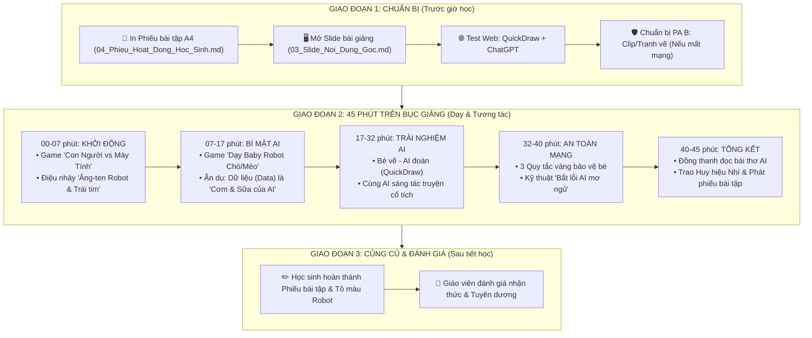

# GIÁO ÁN ĐỔI MỚI: KHÁM PHÁ TRÍ TUỆ NHÂN TẠO (AI)
**Thời lượng**: 45 phút (1 Tiết học chuẩn) | **Đối tượng**: Học sinh Tiểu học (Lớp 1 - Lớp 5)  
**Tác giả**: Giáo viên Tiểu học Giỏi Cấp Quốc Gia | **Tiêu chí**: Siêu trực quan - Hài hước - Dễ hiểu nhất

---

## 🗺️ SƠ ĐỒ CHIẾN LƯỢC TIẾN TRÌNH BÀI GIẢNG (TEACHING FLOW - 45 PHÚT)



---

## I. MỤC TIÊU BÀI HỌC (NGÔN NGỮ TIỂU HỌC)

### 1. Kiến thức
- Học sinh giải thích được AI bằng câu nói siêu đơn giản: *"AI giống như một bạn Robot được con người dạy để biết suy nghĩ và giúp đỡ chúng ta!"*.
- Biết phân biệt rõ ràng: **Con người có Trái tim & Tình yêu thương**, còn **AI có Bộ nhớ siêu khổng lồ & Tốc độ tính toán siêu nhanh**.
- Hiểu được bí mật: **AI thông minh nhờ ăn "Dữ liệu (Data)"** (Hình ảnh, Âm thanh, Chữ viết) mỗi ngày.

### 2. Kỹ năng
- Biết lên bảng tham gia trò chơi vẽ hình cho AI đoán.
- Biết đưa ra ý tưởng nhân vật để "đặt lệnh" cho AI viết truyện cổ tích.

### 3. An toàn kỹ thuật số
- Nhớ như in **3 Quy tắc vàng**: *Không cho AI biết bí mật cá nhân*, *Không tin AI 100% vì AI có lúc mơ ngủ*, và *Bộ não của bé mới là số 1!*

---

## II. CHUẨN BỊ BÀI GIẢNG

### 1. Dành cho Giáo viên:
- Máy tính kết nối máy chiếu / Màn hình TV.
- Slide bài giảng (Dựa trên file `03_Slide_Noi_Dung_Goc.md`).
- Bộ thẻ tranh minh họa (Hình con người, robot, chó/mèo).
- Mở sẵn trình duyệt web:
  - [Google Quick, Draw!](https://quickdraw.withgoogle.com/)
  - [ChatGPT / Copilot](https://chatgpt.com/)

### 2. Dành cho Học sinh:
- Phiếu bài tập tô màu (In từ file `04_Phieu_Hoat_Dong_Hoc_Sinh.md`).
- Hộp màu vẽ, bút chì.

---

## III. TIẾN TRÌNH DẠY HỌC CHI TIẾT (45 PHÚT)

---

### PHẦN 1: KHỞI ĐỘNG & GAME "CON NGƯỜI VS MÁY TÍNH" (7 PHÚT)

#### 🎯 Mục tiêu: 
Thu hút 100% sự chú ý, tạo tiếng cười rộn ràng và giúp các em thấy được sự đặc biệt của Trái tim con người.

#### 🎙️ Lời thoại & Hoạt động của Giáo viên:
- **Giáo viên (Hài hước, giọng truyền cảm)**:  
  *"Chào các nhà khai phá nhí! Hôm nay cô/thầy mang đến lớp mình một người bạn siêu đặc biệt. Người bạn này không ăn cơm, không uống sữa, nhưng lại có một bộ não làm bằng vi mạch kim loại! Trước khi gặp người bạn ấy, chúng ta hãy cùng đấu trí qua trò chơi: **AI GIỎI HƠN? CON NGƯỜI VS MÁY TÍNH!**"*

#### ❓ 4 Câu hỏi đố vui bùng nổ:
1. **Câu 1**: *Thực hiện 10.000 phép tính nhân chia trong 1 giây?*  
   - ➡️ **Cả lớp reo lên**: Máy tính vô địch! 💻
2. **Câu 2**: *Thấy bạn thân bị ngã đau liền chạy lại ôm bạn và an ủi?*  
   - ➡️ **Cả lớp reo lên**: Con người vô địch! ❤️ (Máy tính không có trái tim để thương bạn).
3. **Câu 3**: *Ghi nhớ nội dung của 1 triệu cuốn sách trong thư viện?*  
   - ➡️ **Cả lớp reo lên**: Máy tính vô địch! 📚
4. **Câu 4**: *Vẽ một bức tranh thật đẹp xuất phát từ tình yêu dành cho bố mẹ?*  
   - ➡️ **Cả lớp reo lên**: Con người vô địch! 🎨

#### 💃 Động tác tay Ăng-ten Robot (1 phút):
- **Giáo viên hô**: *"AI Máy tính đâu?"* ➡️ **Học sinh xòe 2 tay lên đầu làm ăng-ten hô**: *"Tít tít tính nhanh!"*
- **Giáo viên hô**: *"Con người đâu?"* ➡️ **Học sinh ôm 2 tay lên ngực trái hô**: *"Yêu thương sáng tạo!"*

---

### PHẦN 2: BÍ MẬT ĐẰNG SAU AI - "CƠM & SỮA CỦA AI LA GÌ?" (10 PHÚT)

#### 🎯 Mục tiêu:
Giải thích khái niệm **Dữ liệu (Data)** bằng hình ảnh ẩn dụ *"Thức ăn của Robot"*.

#### 🐾 Trò chơi nhập vai "Dạy Baby Robot":
- Giáo viên mời 1 bạn học sinh lên bảng đeo bờm ăng-ten đóng vai **Baby Robot AI** (chưa biết gì).
- Giáo viên giơ 5 bức ảnh Con Chó và 5 bức ảnh Con Mèo cho Baby Robot xem:
  - *"Đây là Con Chó: tai dài, mũi to, kêu gâu gâu!"*
  - *"Đây là Con Mèo: tai nhọn, có ria, kêu meow meow!"*
- Giáo viên giơ bức ảnh thứ 11 (một con chó hoạt hình mới) và hỏi: *"Baby Robot ơi, đây là con gì?"*
- Bạn học sinh đóng vai Robot trả lời: *"Con Chó!"* ➡️ **Cả lớp vỗ tay khen ngợi.**

#### 🧠 Rút ra bài học siêu dễ hiểu:
- **Giáo viên**:  
  *"Các con thấy không? Baby Robot không tự nhiên biết con chó hay con mèo. Baby Robot thông minh nhờ được xem **HÀNG TRIỆU BỨC ẢNH**. Hàng triệu bức ảnh đó được gọi là **DỮ LIỆU (DATA)**.  
  👉 **Học sinh ăn Cơm & Uống Sữa để cao lớn 🥛. Còn AI 'ăn Dữ liệu' để trở nên thông minh!**"*

- **Khấu lệnh phản xạ**:  
  - Giáo viên hô: *"Thức ăn của AI là gì?"* ➡️ Cả lớp hô to: *"DỮ LIỆU! DỮ LIỆU!"*

---

### PHẦN 3: TRẢI NGHIỆM THỰC TẾ - "BÉ VẼ AI ĐOÁN & SÁNG TÁC TRUYỆN" (15 PHÚT)

#### 🖥️ Hoạt động 1: Game "Bé Vẽ - AI Đoán" (8 phút)
- **Cách chơi**: Giáo viên mở trang web `quickdraw.withgoogle.com` trên máy chiếu.
- Mời 2 học sinh lên bảng dùng chuột/bút cảm ứng vẽ một vật thể (cái cây, quả táo, ngôi nhà) trong 20 giây.
- AI sẽ phát âm thanh và đoán tên hình vẽ ngay khi các em đưa nét vẽ đầu tiên.
- **Giáo viên giải thích**: *"AI đoán đúng vì AI đã được xem hàng triệu bức tranh quả táo do các bạn nhỏ trên toàn thế giới vẽ trước đó rồi đấy!"*

#### 🎨 Hoạt động 2: "Cùng AI Sáng Tác Truyện Cổ Tích Kỳ Diệu" (7 phút)
- Giáo viên mở ChatGPT trên màn hình lớn và hỏi cả lớp: *"Các con muốn câu chuyện hôm nay có những nhân vật nào?"*
- Học sinh giơ tay đề xuất: *"Một chú thỏ biết bay, một cây nấm biết hát và chú đại bàng thích ăn kem!"*
- Giáo viên gõ câu lệnh vào AI. Sau 3 giây, AI viết ra câu chuyện cổ tích 4 câu cực kỳ vui nhộn.
- **Giáo viên nhấn mạnh**: *"AI viết rất nhanh, nhưng ý tưởng chú thỏ biết bay là của AI hay của các con?"* ➡️ **Của các con! Bộ não con người luôn là số 1!**

---

### PHẦN 4: THẢO LUẬN AN TOÀN - 3 QUY TẮC VÀNG BẢO VỆ BÉ (8 PHÚT)

#### 🛡️ 3 QUY TẮC VÀNG BẢO VỆ BÉ KHI CHƠI VỚI AI:

```
+-----------------------------------------------------------------------+
|                       🛡️ 3 QUY TẮC VÀNG BẢO VỆ BÉ                     |
+-----------------------------------------------------------------------+
| 1. KHÔNG CHIA SẺ BÍ MẬT CÁ NHÂN (🛑 Đèn Đỏ):                         |
|    - Không cho AI biết: Họ tên đầy đủ, địa chỉ nhà, số điện thoại     |
|      bố mẹ, hay mật khẩu tài khoản!                                   |
|                                                                       |
| 2. AI CÓ LÚC "MƠ NGỦ" - KHÔNG TIN 100% (⚠️ Đèn Vàng):                 |
|    - Đôi khi AI bị đoán mò hoặc trả lời sai bét. Luôn hỏi lại         |
|      thầy cô, bố mẹ hoặc kiểm tra sách vở nhé!                        |
|                                                                       |
| 3. TỰ NGHĨ TRƯỚC - AI CHỈ LÀ TRỢ LÝ (🟢 Đèn Xanh):                    |
|    - Không dùng AI làm hộ 100% bài tập về nhà. Não bé mới là          |
|      "siêu máy tính" tuyệt vời nhất!                                  |
+-----------------------------------------------------------------------+
```

#### ❌ Mẹo vui "Bắt lỗi AI mơ ngủ" (1 phút):
- Giáo viên đưa cho AI xem một hình quả chuối nhưng gõ câu hỏi: *"Đây có phải cái điện thoại không?"*
- AI trả lời nhầm hoặc đoán sai ➡️ Giáo viên reo lên: *"Thấy chưa! AI cũng có lúc mơ ngủ đấy nhé, chúng ta không được tin AI 100% đâu!"*

---

### PHẦN 5: TỔNG KẾT & CẤP HUY HIỆU (5 PHÚT)

#### 📜 Bài thơ Đồng Dao AI (Cả lớp đọc đồng thanh 1 phút):
> *"AI giỏi tính, nhớ siêu nhiều,*  
> *Nhưng không có trái tim yêu con người.*  
> *Bé ngoan làm chủ nụ cười,*  
> *Học chăm, suy nghĩ, điểm 10 tương lai!"*

#### 🏅 Trao Huy Hiệu & Phát Phiếu Hoạt Động (4 phút):
- Giáo viên phát phiếu bài tập [04_Phieu_Hoat_Dong_Hoc_Sinh.md](file:///d:/DuAnAIHieuChoHocSinh/04_Phieu_Hoat_Dong_Hoc_Sinh.md) dặn học sinh tô màu Robot ở nhà.
- Trao danh hiệu giấy cho cả lớp: **"NHÀ KHÁI PHÁ AI NHÍ THÔNG THÁI"**.

---

## IV. TÀI LIỆU VÀ CÔNG CỤ TÍCH HỢP

1. **Website trải nghiệm**:
   - Quick, Draw!: `https://quickdraw.withgoogle.com/`
   - AutoDraw: `https://www.autodraw.com/`
2. **File đi kèm trong dự án**:
   - Tiến trình chiến lược: [01_So_Do_Chien_Luoc_Bai_Giang.md](file:///d:/DuAnAIHieuChoHocSinh/01_So_Do_Chien_Luoc_Bai_Giang.md)
   - Nội dung slide: [03_Slide_Noi_Dung_Goc.md](file:///d:/DuAnAIHieuChoHocSinh/03_Slide_Noi_Dung_Goc.md)
   - Phiếu hoạt động: [04_Phieu_Hoat_Dong_Hoc_Sinh.md](file:///d:/DuAnAIHieuChoHocSinh/04_Phieu_Hoat_Dong_Hoc_Sinh.md)
