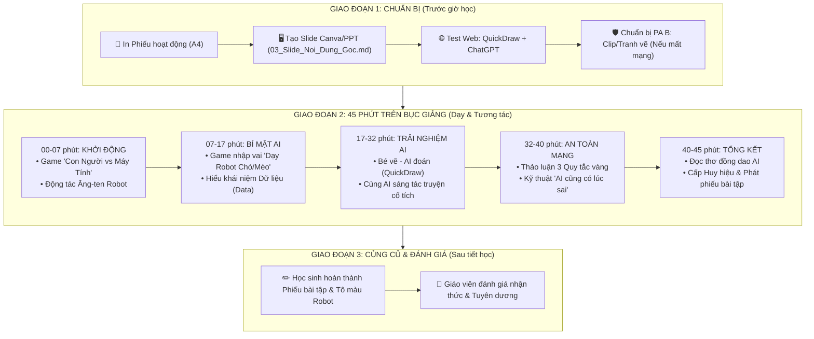

# GIÁO ÁN CHI TIẾT: KHÁM PHÁ TRÍ TUỆ NHÂN TẠO (AI)
**Thời lượng**: 45 phút (1 Tiết học) | **Đối tượng**: Học sinh Tiểu học (Lớp 1 - Lớp 5)  
**Tác giả**: Giáo viên Tiểu học | **Mục tiêu**: Giúp học sinh hiểu AI là gì, AI hoạt động ra sao và cách sử dụng AI an toàn.

---

## 🗺️ SƠ ĐỒ CHIẾN LƯỢC TIẾN TRÌNH BÀI GIẢNG (TEACHING FLOW - 45 PHÚT)

---

## I. MỤC TIÊU BÀI HỌC

### 1. Kiến thức
- Học sinh giải thích được khái niệm **AI (Trí tuệ Nhân tạo)** bằng ngôn ngữ đơn giản: *"AI là những phần mềm/máy tính được con người dạy để biết suy nghĩ và học hỏi, giúp đỡ con người làm việc"*.
- Biết cách phân biệt **Trí tuệ Con người** (cảm xúc, tình yêu thương, sự sáng tạo chân thật) và **Trí tuệ Nhân tạo** (tính toán nhanh, ghi nhớ siêu nhiều, xử lý dữ liệu lớn).
- Hiểu được nguyên lý AI học tập: **AI học từ Dữ liệu (Data)** (hình ảnh, âm thanh, chữ viết) giống như học sinh học từ sách vở và quan sát thế giới xung quanh.

### 2. Kỹ năng
- Biết trải nghiệm và tương tác đơn giản với công cụ AI (ví dụ: vẽ hình cho AI đoán, thử nghiệm nhận diện).
- Biết cách đặt câu hỏi đơn giản hoặc yêu cầu cơ bản cho AI trợ lý.

### 3. Phẩm chất & Đạo đức (An toàn kỹ thuật số)
- Nhận thức được 3 Quy tắc an toàn: **Không chia sẻ thông tin cá nhân**, **Không tin AI 100% (AI có thể đoán sai)**, và **Coi AI là người trợ lý chứ không làm hộ bài tập hoàn toàn**.

---

## II. CHUẨN BỊ BÀI GIẢNG

### 1. Dành cho Giáo viên:
- Máy tính có kết nối Internet, máy chiếu (Projector) hoặc màn hình TV lớp học.
- Slide bài giảng (Dựa trên file `03_Slide_Noi_Dung_Goc.md`).
- Các bộ thẻ bài minh họa (Thẻ tranh con người, thẻ tranh máy tính, thẻ tranh chó/mèo).
- Đường link sẵn các trang web trải nghiệm AI miễn phí:
  - [Google Quick, Draw!](https://quickdraw.withgoogle.com/) (AI đoán hình vẽ)
  - [AutoDraw](https://www.autodraw.com/) (AI biến nét vẽ nguệch ngoạc thành hình đẹp)

### 2. Dành cho Học sinh:
- Phiếu hoạt động học sinh (In từ file `04_Phieu_Hoat_Dong_Hoc_Sinh.md`).
- Bút màu, bút chì.

---

## III. TIẾN TRÌNH DẠY HỌC CHI TIẾT (45 PHÚT)

---

### PHẦN 1: KHỞI ĐỘNG & GAME "CON NGƯỜI VS MÁY TÍNH" (7 PHÚT)

#### 🎯 Mục tiêu: 
Tạo không khí vui vẻ, thu hút sự chú ý và giúp học sinh so sánh khả năng của con người với máy tính thông thường.

#### 🎙️ Lời thoại & Hoạt động của Giáo viên:
- **Giáo viên (nhiệt huyết)**: *"Chào các con! Hôm nay cô/thầy có mang đến lớp một người bạn rất đặc biệt. Nhưng trước khi giới thiệu người bạn này, chúng ta hãy cùng chơi một trò chơi có tên: **Ai Giỏi Hơn? Con Người hay Máy Tính!**"*
- **Giáo viên nêu luật chơi**: Cô sẽ đưa ra các nhiệm vụ, các con hãy giơ tay chọn xem **Con người** làm tốt hơn hay **Máy tính** làm tốt hơn nhé!

#### ❓ Các câu hỏi đố vui:
1. **Câu 1**: *Tính 9.876 x 5.432 trong 1 giây?* ➡️ **Máy tính** 💻
2. **Câu 2**: *Cảm thấy buồn khi bạn thân bị ốm và ôm bạn một cái?* ➡️ **Con người** ❤️
3. **Câu 3**: *Nhớ tên của 1 triệu cuốn sách trong thư viện cùng lúc?* ➡️ **Máy tính** 📚
4. **Câu 4**: *Tự nghĩ ra một câu chuyện cổ tích kỳ diệu xuất phát từ tình thương mẹ?* ➡️ **Con người** 🌟

#### 💃 Động tác tay phản xạ (1 phút):
- Hô *"AI Máy tính!"* ➡️ Cả lớp xòe 2 tay trên đầu làm ăng-ten hô *"Tít tít tính nhanh!"*.
- Hô *"Con người!"* ➡️ Đặt 2 tay lên ngực trái hô *"Yêu thương sáng tạo!"*.

---

### PHẦN 2: BÍ MẬT ĐẰNG SAU AI - AI HỌC NHƯ THẾ NÀO? (10 PHÚT)

#### 🎯 Mục tiêu:
Giải thích khái niệm **Dữ liệu (Data)** và cách AI học hỏi bằng ví dụ trực quan dễ hiểu.

#### 🐾 Trò chơi nhập vai "Dạy Robot":
- Giáo viên chọn 1 học sinh lên đóng vai **Robot AI mới sinh**.
- Giáo viên đóng vai **Người dạy (Data Trainer)**, giơ 5 bức ảnh Con Chó và 5 bức ảnh Con Mèo.
- Hỏi Robot ở bức ảnh thứ 11 ➡️ Robot trả lời đúng ➡️ Cả lớp vỗ tay.

#### 🧠 Rút ra bài học cốt lõi:
- **Giáo viên**: *"Robot AI không tự nhiên biết mọi thứ. AI thông minh vì nó được xem **RẤT NHIỀU HÌNH ẢNH**. Hàng triệu hình ảnh đó được gọi là **DỮ LIỆU (DATA)**. Dữ liệu chính là **thức ăn bổ dưỡng** của AI!"*

---

### PHẦN 3: TRẢI NGHIỆM THỰC TẾ & TƯƠNG TÁC VỚI AI (15 PHÚT)

#### 🖥️ Hoạt động 1: Trò chơi "Bé vẽ - AI đoán" (8 phút)
- Sử dụng [Google Quick, Draw!](https://quickdraw.withgoogle.com/) trên máy chiếu.
- Mời 2 học sinh lên bảng vẽ hình đơn giản trong 20 giây để AI đoán tên.

#### 🎨 Hoạt động 2: Thử nghiệm "Trợ lý AI tạo câu chuyện kỳ diệu" (7 phút)
- Mở ChatGPT/Copilot trên màn hình lớn.
- Học sinh đưa ý tưởng nhân vật (Ví dụ: *Một chú thỏ biết bay và cây nấm biết hát*).
- AI tạo ra câu chuyện ngắn 4 câu trong vài giây. Giáo viên đọc diễn cảm cho cả lớp nghe.

---

### PHẦN 4: THẢO LUẬN & 3 QUY TẮC VÀNG KHI SỬ DỤNG AI (8 PHÚT)

#### 🛡️ 3 QUY TẮC VÀNG BẢO VỆ BÉ:
1. **KHÔNG CHIA SẺ BÍ MẬT CÁ NHÂN**: Không cho AI biết họ tên đầy đủ, địa chỉ nhà, số điện thoại bố mẹ hay mật khẩu.
2. **KHÔNG TIN AI 100%**: AI đôi khi bị tưởng tượng sai (Ảo giác AI). Luôn cần kiểm tra lại với thầy cô, bố mẹ!
3. **NÃO BÉ LÀ SỐ 1**: Tự suy nghĩ trước, AI chỉ là người trợ lý giúp sức!

#### ❌ Mẹo thử thách "AI đoán sai" (1 phút):
- Cố tình cho AI xem hình quả chuối nhưng bảo là điện thoại ➡️ Cho học sinh phát hiện và cười xòa ➡️ Khắc sâu quy tắc không tin AI 100%.

---

### PHẦN 5: TỔNG KẾT & CẤP HUY HIỆU (5 PHÚT)

#### 📜 Đọc đồng dao AI ghi nhớ (1 phút):
> *"AI giỏi tính, nhớ siêu nhiều,*  
> *Nhưng không có trái tim yêu con người.*  
> *Bé ngoan làm chủ nụ cười,*  
> *Học chăm, suy nghĩ, điểm 10 tương lai!"*

#### 🏅 Trao huy hiệu & Phát phiếu hoạt động (4 phút):
- Phát phiếu [04_Phieu_Hoat_Dong_Hoc_Sinh.md](file:///d:/DuAnAIHieuChoHocSinh/04_Phieu_Hoat_Dong_Hoc_Sinh.md) dặn các em tô màu Robot ở nhà.
- Trao danh hiệu giấy: **"NHÀ KHÁI PHÁ AI NHÍ XUẤT SẮC"**.

---

## IV. TÀI LIỆU VÀ CÔNG CỤ TÍCH HỢP

1. **Website trải nghiệm**:
   - Quick, Draw!: `https://quickdraw.withgoogle.com/`
   - AutoDraw: `https://www.autodraw.com/`
2. **File đi kèm**:
   - Tiến trình chiến lược: [01_So_Do_Chien_Luoc_Bai_Giang.md](file:///d:/DuAnAIHieuChoHocSinh/01_So_Do_Chien_Luoc_Bai_Giang.md)
   - Nội dung slide: [03_Slide_Noi_Dung_Goc.md](file:///d:/DuAnAIHieuChoHocSinh/03_Slide_Noi_Dung_Goc.md)
   - Phiếu hoạt động: [04_Phieu_Hoat_Dong_Hoc_Sinh.md](file:///d:/DuAnAIHieuChoHocSinh/04_Phieu_Hoat_Dong_Hoc_Sinh.md)
